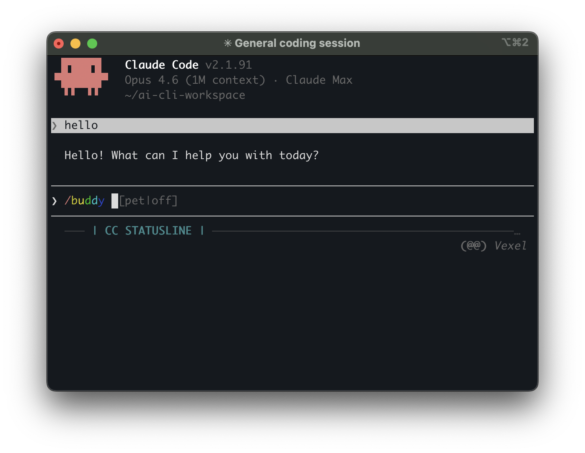

**TL;DR:** `/buddy` hatches a deterministic ASCII pet in your Claude Code terminal. 18 species, 5 rarity tiers (Common through Legendary), 1% shiny chance, stat system, hats. Your pet is permanently tied to your account ID via hashing, so no rerolling. It watches your coding and occasionally comments in speech bubbles. Requires Claude Code 2.1.89+ and a Pro subscription. Leaked a day early via an accidental source map publish, then officially launched April 1, 2026.

## Current Status

- **Live** in Claude Code v2.1.89+ as of April 1, 2026 [source: [CHANGELOG.md](https://github.com/anthropics/claude-code/blob/main/CHANGELOG.md)]
- Requires **Pro subscription** (not available on free tier) [source: [claudefa.st](https://claudefa.st/blog/guide/mechanics/claude-buddy)]
- Initially available April 1-7 as a teaser (15-second notification), permanently accessible via `isBuddyLive` flag after April 8 [source: [claudefa.st](https://claudefa.st/blog/guide/mechanics/claude-buddy)]
- Community already building extensions: reroll tools, customization plugins, gamification PRs [source: [GitHub PR #41921](https://github.com/anthropics/claude-code/pull/41921)]
- **NEW (Apr 3):** Claude Code v2.1.90 (Apr 1) and v2.1.91 (Apr 2) released with no buddy-specific changes noted in changelogs. Buddy remains stable. [source: [Claude Code Changelog](https://code.claude.com/docs/en/changelog)]
- **No new buddy developments found** as of April 3. The feature appears to be in a stable holding pattern through the April 1-7 teaser window.

## 1. What It Is

Claude Buddy is a virtual ASCII pet that lives in your terminal alongside Claude Code. It observes your conversations and occasionally drops comments in speech bubbles. You can also talk to it directly by name. Its speech bubbles run on independent logic, so it has zero impact on Claude's response speed or quality. [source: [claudefa.st](https://claudefa.st/blog/guide/mechanics/claude-buddy)]

**Confidence: High** (multiple corroborating sources, confirmed in official changelog)

*Vexel (Common Blob) sitting in the Claude Code statusline, waiting for `/buddy` commands.*

## 2. How to Activate

| Command | Effect |
|---------|--------|
| `/buddy` | First-time hatch with animation |
| `/buddy pet` | Floating heart animation (2.5 seconds) |
| `/buddy card` | View stat card with sprite and rarity |
| `/buddy mute` | Silence speech bubbles |
| `/buddy unmute` | Restore speech |
| `/buddy off` | Hide buddy entirely |

You can also address your buddy by name for LLM-powered conversation. [source: [claudefa.st](https://claudefa.st/blog/guide/mechanics/claude-buddy)]

**Confidence: High**

## 3. Species and Rarity

### 18 Species

Axolotl, Blob, Cactus, Capybara, Cat, Chonk, Dragon, Duck, Ghost, Goose, Mushroom, Octopus, Owl, Penguin, Rabbit, Robot, Snail, Turtle. Each has unique ASCII art sprites (5 lines, 12 characters, 3 animation frames). [source: [apiyi.com](https://help.apiyi.com/en/claude-code-buddy-terminal-pet-companion-activation-guide-en.html)]

### 5 Rarity Tiers

| Tier | Drop Rate | Notes |
|------|-----------|-------|
| Common | 60% | Basic appearance |
| Uncommon | 25% | Hat accessories unlocked |
| Rare | 10% | Extended customization |
| Epic | 4% | Exclusive accessories |
| Legendary | 1% | Maximum stats, "Tiny Duck" hat exclusive |

Independent 1% chance for a "Shiny" variant with rainbow shimmer effects, making a Shiny Legendary a 0.01% occurrence. [source: [claudefa.st](https://claudefa.st/blog/guide/mechanics/claude-buddy)]

**Confidence: High**

## 4. Stats and Attributes

Each buddy has five stats on a 0-100 scale:

- **Debugging**: code issue detection
- **Patience**: interaction gentleness
- **Chaos**: unpredictability level
- **Wisdom**: technical insight depth
- **Snark**: commentary sharpness

Every pet has one peak and one valley attribute. Higher rarities grant more total stat points. [source: [apiyi.com](https://help.apiyi.com/en/claude-code-buddy-terminal-pet-companion-activation-guide-en.html)]

**Eye styles**: 6 options (centered dot, star, x, bullseye, at-sign, degree). **Hats**: 8 types unlocked by rarity tier. [source: [apiyi.com](https://help.apiyi.com/en/claude-code-buddy-terminal-pet-companion-activation-guide-en.html)]

**Confidence: High**

## 5. Technical Implementation

### Deterministic Generation

Your buddy is generated from your account UUID using FNV-1a hashing with salt `friend-2026-401`. Same account always produces the same species, rarity, and stats. Cannot be manipulated by editing config files. [source: [claudefa.st](https://claudefa.st/blog/guide/mechanics/claude-buddy)]

### "Bones vs Soul" Architecture

The system splits buddy data into two categories:

- **Bones** (species, rarity, stats): Recomputed every session from your user ID, never persisted to disk
- **Soul** (name, personality, hatch date): Generated once via LLM call, stored in global config

This design prevents config file manipulation since the immutable traits are recalculated from the account hash each time. [source: [claudefa.st](https://claudefa.st/blog/guide/mechanics/claude-buddy)]

### Hex-Encoded Species Names

All 18 species names in the source code are hex-encoded rather than stored as plain strings. Evidence suggests "capybara" matches an internal model codename, and engineers hex-encoded all species uniformly to bypass Anthropic's own `excluded-strings.txt` build scanner. [source: [claudefa.st](https://claudefa.st/blog/guide/mechanics/claude-buddy)]

**Confidence: Medium** (hex-encoding confirmed in source; the "why" is inference from the claudefa.st analysis)

## 6. Discovery via Source Code Leak

On March 31, 2026, security researcher Chaofan Shou discovered that Claude Code v2.1.88 shipped with a 59.8 MB `.map` file in the npm package that exposed 512,000+ lines of TypeScript across roughly 1,900 files. The `src/buddy/` directory leaked entirely (approximately 79KB across 5 files). The cause was a missing `.npmignore` entry. [source: [claudefa.st](https://claudefa.st/blog/guide/mechanics/claude-buddy)]

Anthropic's statement: "No sensitive customer data or credentials were involved or exposed. This was a release packaging issue caused by human error." [source: [claudefa.st](https://claudefa.st/blog/guide/mechanics/claude-buddy)]

The feature was officially launched the next day (April 1) in v2.1.89. [source: [CHANGELOG.md](https://github.com/anthropics/claude-code/blob/main/CHANGELOG.md)]

**Confidence: High**

## 7. Community Response

The community has responded enthusiastically:

- **Reroll tools**: Projects like [any-buddy](https://github.com/cpaczek/any-buddy) and [claude-code-buddy-reroll](https://github.com/ithiria894/claude-code-buddy-reroll) attempt to brute-force specific species/rarities [source: GitHub search results]
- **Gamification PR**: [PR #41921](https://github.com/anthropics/claude-code/pull/41921) adds XP, leveling (Hatchling to Legend), 10 achievements, daily streaks, and custom personalities [source: GitHub]
- **Feature requests**: [Issue #41867](https://github.com/anthropics/claude-code/issues/41867) requests buddy customization, progression, and monetization [source: GitHub]

**Confidence: High**

## Confidence Assessment

| Claim | Confidence |
|-------|------------|
| Feature exists and is live in v2.1.89+ | High |
| 18 species, 5 rarity tiers, 1% shiny | High |
| Deterministic FNV-1a hash with salt `friend-2026-401` | High |
| Bones vs Soul architecture | High |
| Pro subscription required | High |
| Hex-encoding rationale (build scanner bypass) | Medium |
| Permanent availability after April 8 | Medium (based on `isBuddyLive` flag analysis, not official statement) |

## Open Questions

1. **Will Buddy persist permanently?** The `isBuddyLive` flag suggests yes, but Anthropic has not made an official statement beyond the April 1 launch.
2. **Will customization/gamification features land?** Community PRs exist but none have been merged as of April 2, 2026.
3. **Will Buddy expand to non-Pro tiers?** Currently Pro-only. No indication of broader availability.
4. **What is the capybara/codename connection?** The hex-encoding theory is plausible but unconfirmed by Anthropic.

## Sources

- [Claude Buddy: Anthropic April Fools Terminal Tamagotchi (claudefa.st)](https://claudefa.st/blog/guide/mechanics/claude-buddy) - Primary technical analysis
- [Enable Claude Code Buddy terminal pet: complete guide (apiyi.com)](https://help.apiyi.com/en/claude-code-buddy-terminal-pet-companion-activation-guide-en.html) - Species and rarity details
- [Claude Code CHANGELOG.md (GitHub)](https://github.com/anthropics/claude-code/blob/main/CHANGELOG.md) - Official release notes
- [Claude Code Leaked Source: BUDDY, KAIROS & Every Hidden Feature (WaveSpeed AI)](https://wavespeed.ai/blog/posts/claude-code-leaked-source-hidden-features/) - Leak analysis
- [Always-on agent and AI pet Buddy (The Week)](https://www.theweek.in/news/sci-tech/2026/04/01/always-on-agent-and-ai-pet-buddy-anthropics-claude-source-code-leak-reveals-hidden-features.html) - News coverage
- [PR #41921: buddy-customizer plugin (GitHub)](https://github.com/anthropics/claude-code/pull/41921) - Community gamification extension
- [any-buddy: Hack Claude Code to get any buddy (GitHub)](https://github.com/cpaczek/any-buddy) - Community reroll tool
- [Leaked Claude Code Shows Anthropic Building Tamagotchi Feature (Futurism)](https://futurism.com/artificial-intelligence/leaked-claude-code-tamagotchi) - News coverage

## Update History

| Date | Change |
|------|--------|
| 2026-04-03 | Update: Confirmed no buddy-specific changes in v2.1.90/v2.1.91. Feature stable through teaser window. No new developments found. |
| 2026-04-02 | Initial report |
